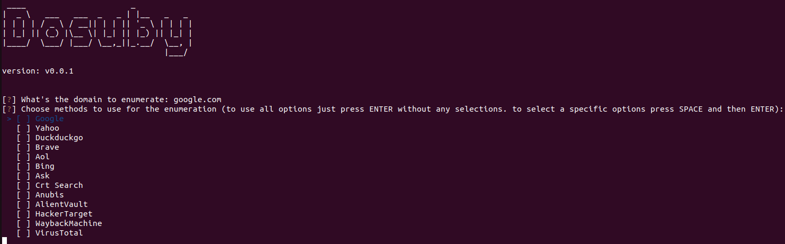
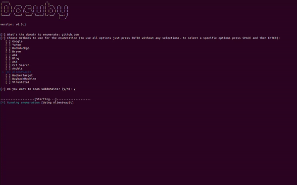

# Dosuby

Dosuby is a tool developed in Python that aims to enumerate subdomains of a parent domain. It uses multiple techniques for enumeration, allowing for a comprehensive subdomain scan. Additionally, Dosuby has the option to scan the enumerated domains.

## Installation

1. Clone the repository:
   ```
   git clone https://github.com/deidax/dosuby.git
   ```
2. Navigate to the project directory:
   ```
   cd dosuby/
   ```
3. Install the required dependencies:
   ```
   pip install -r requirements.txt
   ```

## Usage

```
python dosuby.py
```

The above command will start the tool



Default enumeration

Enumeration with scan


## Contributing

Contributions are welcome! If you find a bug or would like to suggest a new feature, please open an issue or submit a pull request.

## License

This project is licensed under the MIT License. See the [LICENSE](LICENSE) file for details.
